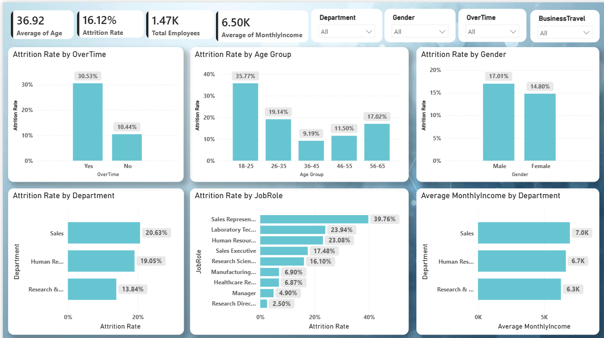

# HR Analytics - Employee Attrition

## 📌 Project Overview

This project analyzes employee attrition using Python, Pandas, and Power BI.

The objective is to identify employee attrition patterns and provide insights that can help HR teams understand employee turnover.

## 🛠️ Tools & Technologies

- Python
- Pandas
- NumPy
- Matplotlib
- Power BI
- Jupyter Notebook

## 📊 Analysis Performed

- Overall employee attrition rate
- Attrition by department
- Attrition by gender
- Attrition by overtime
- Attrition by age group
- Attrition by job role
- Attrition by education field
- Attrition by business travel
- Average monthly income by department

## 🔍 Key Insights

- Overall employee attrition rate is approximately 16.12%.
- Employees working overtime have a significantly higher attrition rate of approximately 30.53%.
- Sales Representatives have the highest attrition rate at approximately 39.76%.
- Research Directors have the lowest attrition rate at approximately 2.50%.
- Employees aged 18–25 have the highest attrition rate at approximately 35.77%.
- Sales has the highest department-level attrition rate at approximately 20.63%.
- Male employees have a slightly higher attrition rate than female employees.

## 📈 Power BI Dashboard

The project includes an interactive Power BI dashboard showing employee attrition and workforce insights.


## 📁 Project Structure

```text
HR-Analytics-Employee-Attrition/
│
├── Python/
│   ├── HR_Attrition_Analysis.ipynb
│   └── README.md
│
├── PowerBI/
│   ├── HR_Analytics_Dashboard.pbix
│   ├── HR_Analytics_Dashboard.png
│   └── README.md
│
├── Data/
│   └── HR_Attrition_Dataset.csv
│
└── README.md
